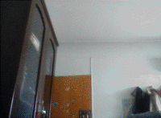

# OutletDetector



This is an example of training a boosted cascade of weak classifiers for electrical outlet detection using OpenCV. 
The official document is [here](https://docs.opencv.org/master/dc/d88/tutorial_traincascade.html){:target="_blank"}.

## Requirements
* OpenCV=3.2.0 (OpenCV 4.x has removed cascade trainer applications. I also tried OpenCV 3.4.0, however, the result is not as good as that of 3.2.0. )

* imgaug

## Usage
1. Install requirements

    Download [opencv 3.2.0 release package](https://sourceforge.net/projects/opencvlibrary/files/opencv-win/3.2.0/opencv-3.2.0-vc14.exe/download){:target="_blank"}.
    Extract and add %your_opencv_root%\build\x64\vc14\bin to PATH. If you are using linux, you need build the source by yourself. Remember to select BUILD_APP option.

    Install python requirements

    ```
    pip install -r requirements.txt
    ```

2. Augment positive example
    
    ```
    python augmentation.py
    ```
    
    The positive examples will be stored in dir 'p'.
3. Create positive and negative list

    ```
    python create_lst.py
    ```
    
    This will creates pos.lst and neg.lst.
    
4. Start training
  
    If you want to detect the same outlet pattern as mine, you can directly use the trained xml in dir 'classifier'. 
    Otherwise, you need first empty the path 'classifier' and run train.bat (or change to train.sh on linux).
    
    train.bat
    
    ```
    opencv_createsamples -vec outlet.vec -info pos.lst -num 401 -w 24 -h 24
    opencv_traincascade -data classifier -vec outlet.vec -bg neg.lst -numPos 380 -numNeg 300 -numStages 15 -w 24 -h 24
    ```
    
    The meaning of parameters can be found in the [official document](https://docs.opencv.org/master/dc/d88/tutorial_traincascade.html){:target="_blank"}.
    It should be noted that the -numPos should be set somewhat less than -num to make training successful.
    
5. Test your model

    ```
    python haar_find.py
    ```
    
    You can select detecting in image or in webcam stream by switching mode in haar_find.py.
    
